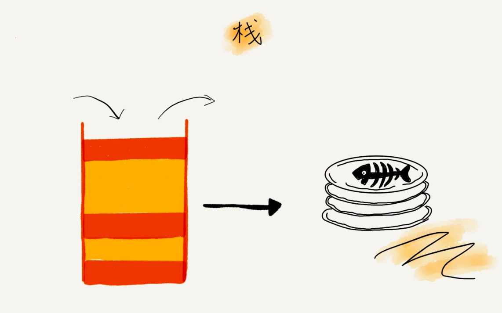

# 如何理解栈
栈是一种操作受限的数据结构，后进者先出，先进着后出（First in later out）
当某个数据集合只涉及在一端插入或者删除数据，并且满足后进者先出、先进者后出的特性，这时我们就应该首选"栈"这种数据结构。

链表的实现可以有两种方式：
- 基于数组实现：**顺序栈**
- 基于链表实现：**链式栈**

时间复杂度：
- 入栈 (O(1))
- 出栈 (O(1))

相关应用：
1. 函数调用栈
2. 表达式求值
3. 括号匹配